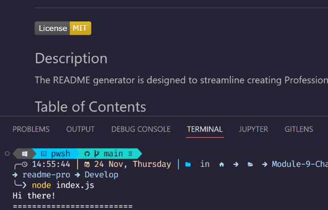

# Professional README Generator

## Description

The README generator is designed to streamline creating Professional README files for developers.

## Table of Contents

- [Installation](#installation)
- [Usage](#usage)
- [Screenshots](#screenshots)
- [License](#license)

## Installation

You will need Node.js to run the application. You can find a guide on installation [here](https://coding-boot-camp.github.io/full-stack/nodejs/how-to-install-nodejs).

**Step 1**

> Clone the repository to your local machine.

**Step 2**

> cd to the directory with your cloned repo. In this case, you'll want to be in the "Develop" directory.

**Step 3**
The repo comes with a package.json with the required dependencies to type the following command into your CLI

> `npm install`

> `npm install`

Now you’re ready to start generating your README.

## Usage

##### To run the application, type enter _node \<filename\>_ into your command prompt.

**Use case example**

> `node index.js`

The app will give you a series of prompts to answer. Some are required, while others are optional. The app prompts you to open a notepad for your answers for some sections. Data entered in the notepad should be formatted in the markdown language, as this will be rendered accordingly in your readme at the end.

Save and close the notepad once you've entered the requested data.

Once you've answered all the questions, your README file is auto-generated.

## Screenshots

## License

MIT License

Copyright (c) 2022 Joseph

Permission is hereby granted, free of charge, to any person obtaining a copy
of this software and associated documentation files (the "Software"), to deal
in the Software without restriction, including without limitation the rights
to use, copy, modify, merge, publish, distribute, sublicense, and/or sell
copies of the Software, and to permit persons to whom the Software is
furnished to do so, subject to the following conditions:

The above copyright notice and this permission notice shall be included in all
copies or substantial portions of the Software.

THE SOFTWARE IS PROVIDED "AS IS", WITHOUT WARRANTY OF ANY KIND, EXPRESS OR
IMPLIED, INCLUDING BUT NOT LIMITED TO THE WARRANTIES OF MERCHANTABILITY,
FITNESS FOR A PARTICULAR PURPOSE AND NONINFRINGEMENT. IN NO EVENT SHALL THE
AUTHORS OR COPYRIGHT HOLDERS BE LIABLE FOR ANY CLAIM, DAMAGES OR OTHER
LIABILITY, WHETHER IN AN ACTION OF CONTRACT, TORT OR OTHERWISE, ARISING FROM,
OUT OF OR IN CONNECTION WITH THE SOFTWARE OR THE USE OR OTHER DEALINGS IN THE
SOFTWARE.

Licensed under the <a href="/microsoft/vscode/blob/main/LICENSE.txt">MIT</a> license.

#### Questions

**How to reach me**

- <a href="https://github.com/joesen-dev">Github</a>
- Email josephsenyonga38@gmail.com
